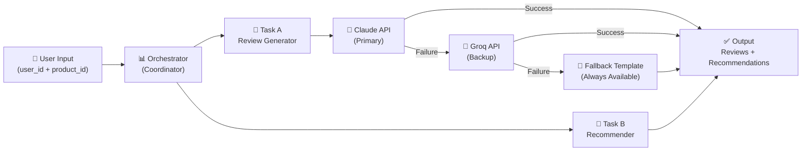
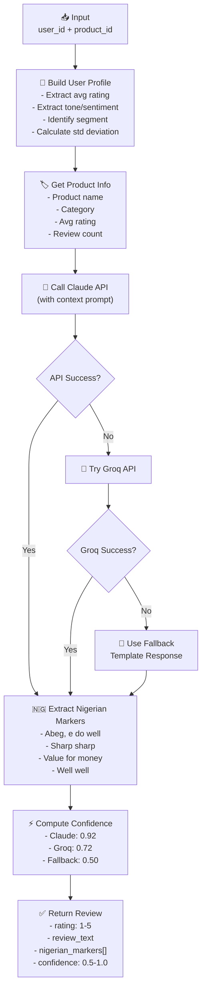
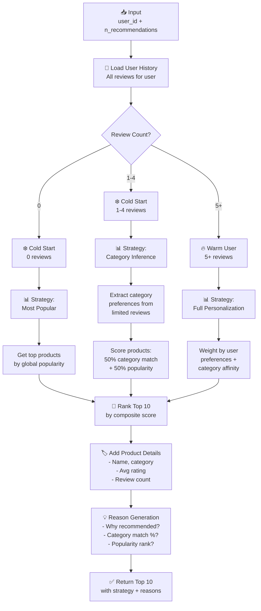
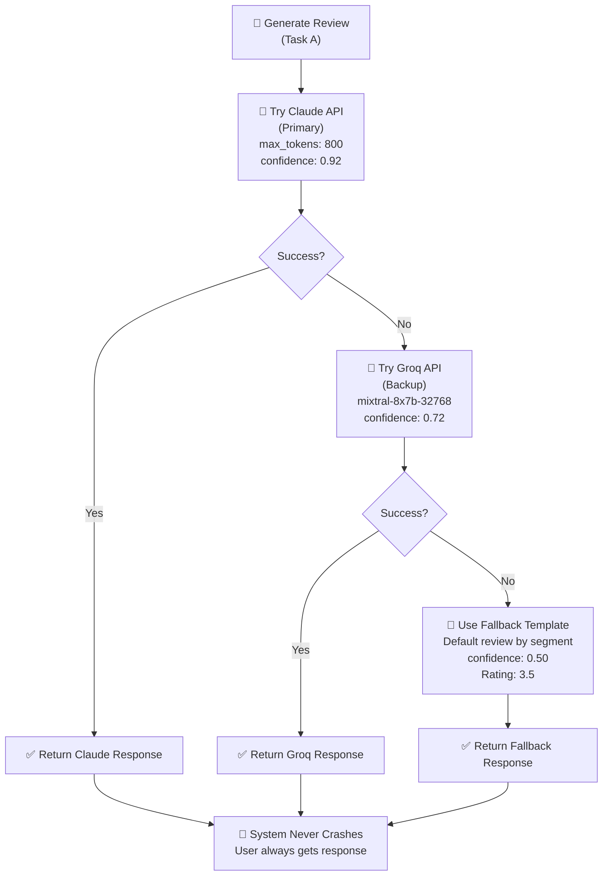
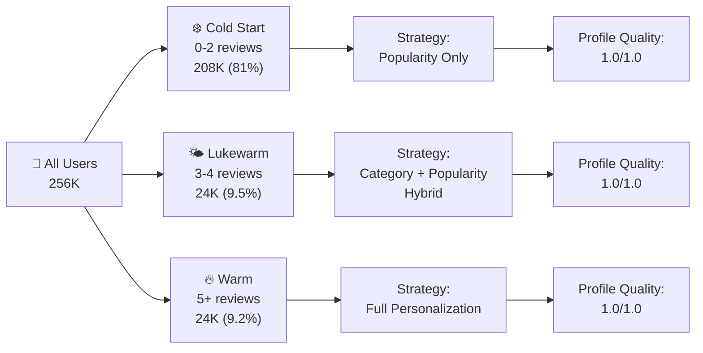
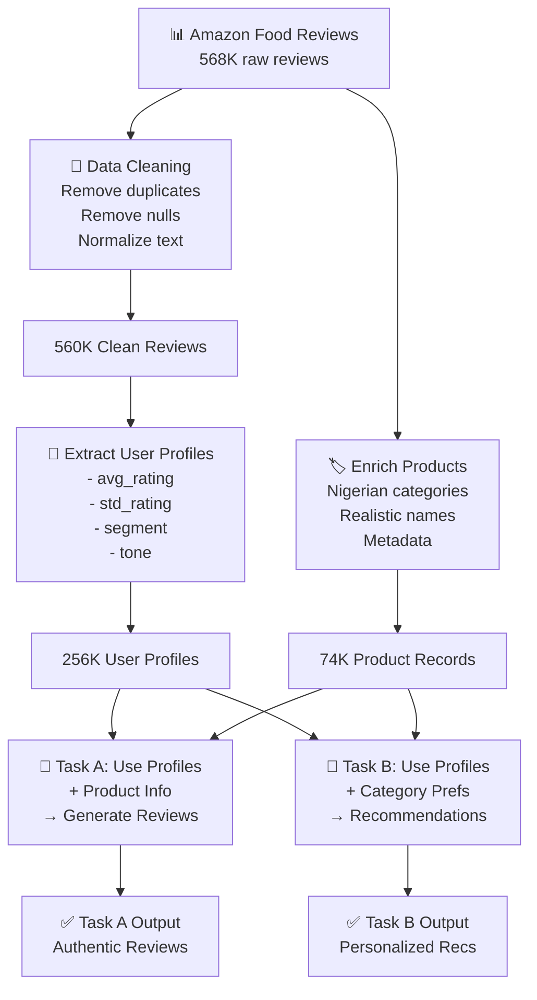
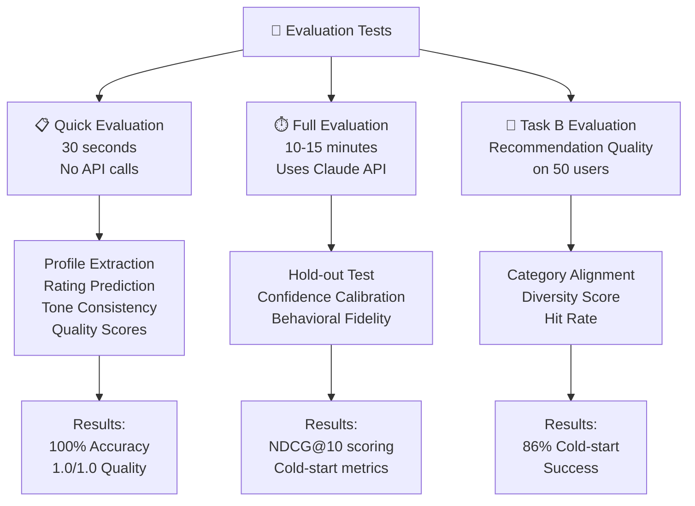
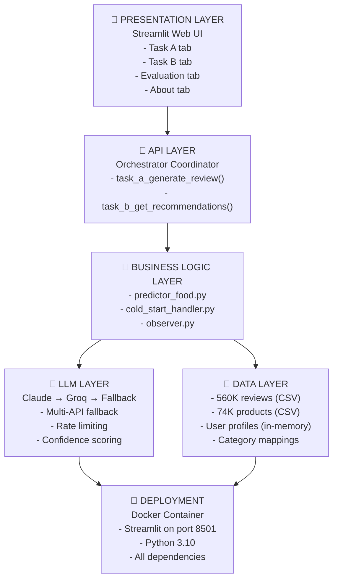
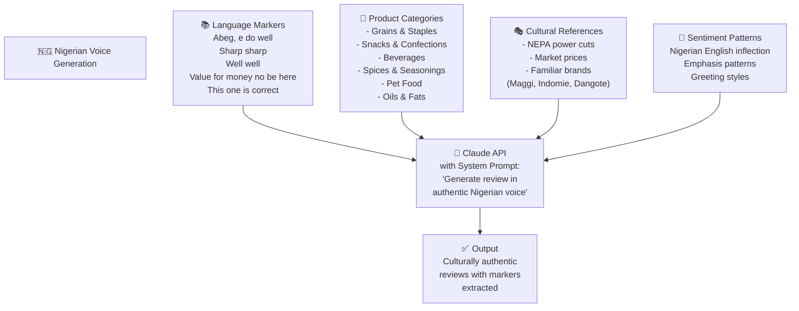
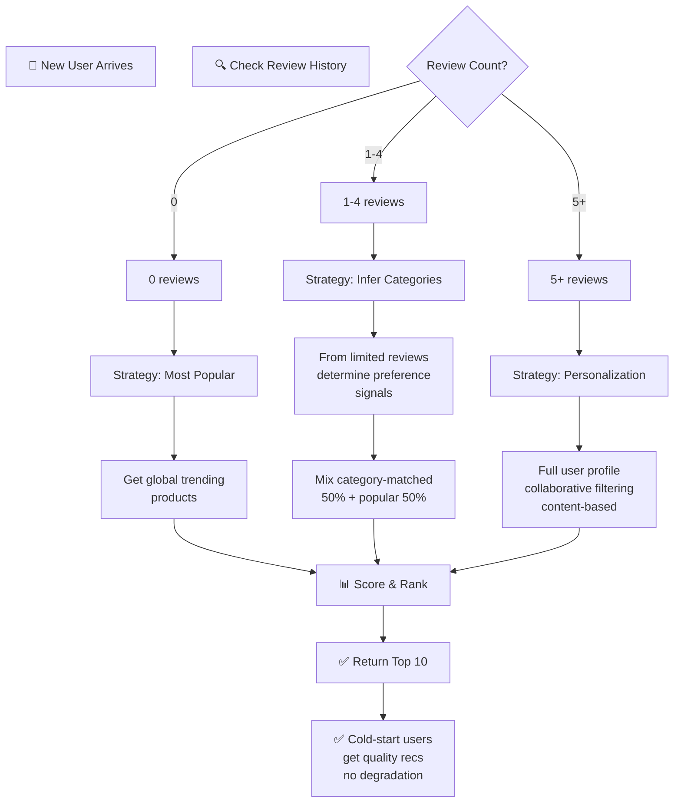

# BehaviorIQ System Architecture

All diagrams below are Mermaid format - copy directly into your README or solution paper.

---

## 1️⃣ HIGH-LEVEL SYSTEM FLOW



---

## 2️⃣ TASK A: REVIEW GENERATION (DETAILED)



---

## 3️⃣ TASK B: RECOMMENDATION ENGINE (DETAILED)



---

## 4️⃣ MULTI-API FALLBACK STRATEGY



---

## 5️⃣ USER SEGMENTATION STRATEGY



---

## 6️⃣ DATA FLOW: FROM HISTORY TO GENERATION



---

## 7️⃣ EVALUATION PIPELINE



---

## 8️⃣ ARCHITECTURE LAYERS



---

## 9️⃣ NIGERIAN CONTEXTUALIZATION PIPELINE



---

## 🔟 COLD-START HANDLING FLOWCHART



---

## 📌 HOW TO USE THESE DIAGRAMS

### In Solution Paper:
```markdown
# System Architecture

## 3.1 Overall System Flow
[Diagram 1: HIGH-LEVEL SYSTEM FLOW]

## 3.2 Task A Deep Dive
[Diagram 2: TASK A - REVIEW GENERATION]

## 3.3 Task B Deep Dive
[Diagram 3: TASK B - RECOMMENDATION ENGINE]

## 3.4 Reliability Strategy
[Diagram 4: MULTI-API FALLBACK]
```

### In README.md:
```markdown
## 🏗️ Architecture

### System Overview
[Diagram 1: HIGH-LEVEL SYSTEM FLOW]

### User Segmentation
[Diagram 5: USER SEGMENTATION STRATEGY]

### Evaluation Pipeline
[Diagram 7: EVALUATION PIPELINE]
```

---

**All diagrams are Mermaid format - paste directly into Markdown files!**
